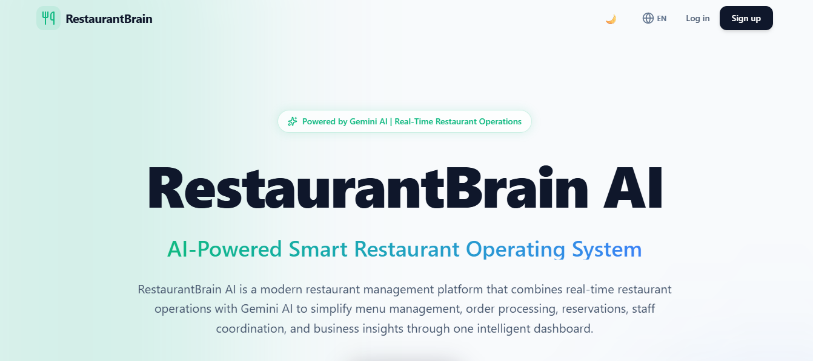
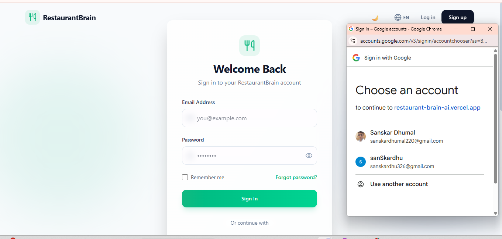
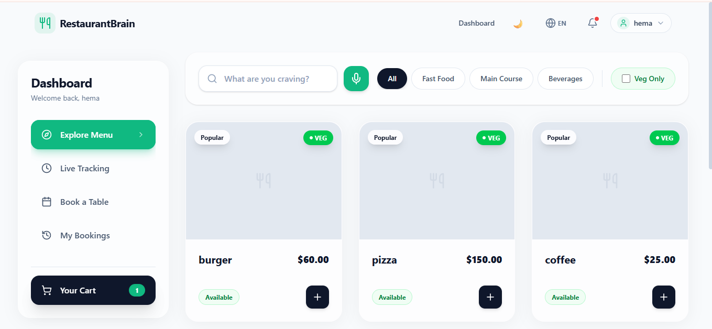
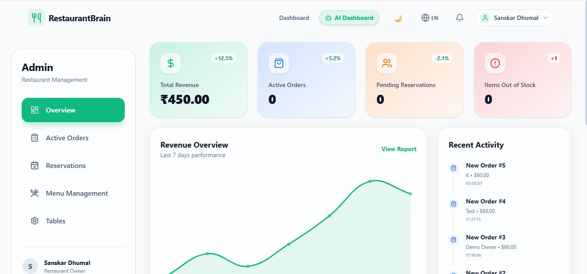
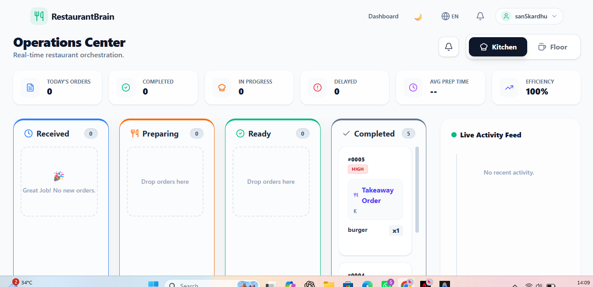
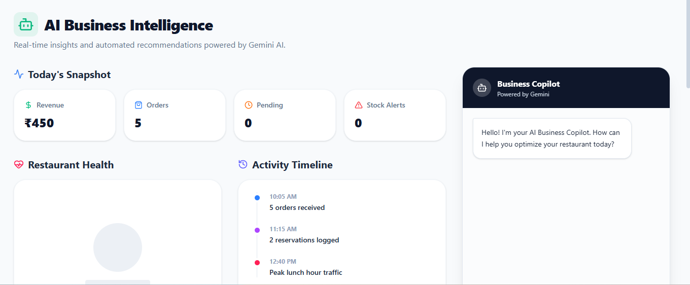

<div align="center">

# 🧠 RestaurantBrain AI

**The Intelligent Operating System for Modern Restaurants**

[](#)
[](#)
[](#)
[](#)
[](#)
[](#)
[](#)
[](https://opensource.org/licenses/MIT)

*An innovative, role-based platform designed to streamline restaurant operations, enhance customer experience, and provide AI-driven business insights.*

---

### 🚀 [View Live Demo](https://restaurant-brain-ai.vercel.app/) | 💻 [GitHub Repository](https://github.com/sanskardhumal220-sys/RestaurantBrain-AI)

</div>

---

## 🎯 Problem Statement

The modern restaurant industry suffers from fragmented systems. Owners rely on separate software for reservations, POS, inventory, and analytics, leading to data silos, inefficiencies, and poor customer experiences. Small to medium-sized restaurants often lack the budget for high-end data analysts, leaving valuable operational data unutilized, resulting in wasted inventory, understaffed shifts, and missed revenue opportunities.

## 💡 Solution

**RestaurantBrain AI** is a unified, intelligent restaurant management platform. It centralizes operations into a single ecosystem connecting Customers, Staff, and Owners. By leveraging **Google Gemini AI**, the platform transforms raw restaurant data into actionable insights—acting as an always-on business copilot that analyzes revenue, health scores, and operational bottlenecks.

---

## ✨ Key Features

### 🛒 Customer
- **Digital Menu**: Browse categories and items seamlessly.
- **Cart & Order Placement**: Intuitive cart management and checkout.
- **Live Order Tracking**: Real-time status updates on active orders.
- **Reservation System**: Book tables in advance with status tracking.
- **Google Authentication**: Frictionless onboarding with one-click Google Sign-In.
- **Email/Password Login**: Traditional, secure authentication alternative.

### 👑 Restaurant Owner
- **Dashboard**: High-level overview of daily operations.
- **Revenue Analytics**: Track sales, top-performing items, and financial trends.
- **Menu Management**: Full CRUD operations for menu items and pricing.
- **Category Management**: Organize the menu dynamically.
- **Reservation Approval**: Accept or decline incoming customer bookings.
- **Order Monitoring**: Oversee all active and past orders.
- **AI Dashboard**: Deep dive into AI-generated business insights.

### 👨‍🍳 Staff
- **Kitchen Display System (KDS)**: View incoming orders in real-time.
- **Order Status Updates**: Move orders through Preparing → Ready → Served.
- **Waiter Dashboard**: Dedicated interface for floor staff.
- **Table Management**: Monitor table statuses and assignments.

### 🤖 AI Features (Powered by Google Gemini)
- **AI Business Copilot**: Chat directly with your restaurant's data.
- **Restaurant Health Score**: An AI-calculated metric indicating overall business health.
- **AI Insights**: Automated analysis of sales trends and operational bottlenecks.
- **Smart Recommendations**: Data-driven suggestions for menu optimization and staffing.

---

## 🛠️ Technology Stack

| Layer | Technology |
| :--- | :--- |
| **Frontend** | React, Vite, Tailwind CSS, Framer Motion, Lucide React |
| **Backend** | Python, Flask, SQLAlchemy, Flask-RESTful |
| **Database** | SQLite (Development) / PostgreSQL (Production ready) |
| **Authentication**| JWT (JSON Web Tokens), Google OAuth 2.0 |
| **AI Module** | Google Gemini Pro API |
| **Deployment** | Vercel (Serverless Functions) |

---

## 🏗️ System Architecture

```text
       [ Customer ]          [ Staff ]          [ Owner ]
            │                    │                  │
            └──────────────┐     │     ┌────────────┘
                           ▼     ▼     ▼
                ┌─────────────────────────────────┐
                │      React Frontend (Vite)      │
                │   (Tailwind CSS, React Router)  │
                └────────────────┬────────────────┘
                                 │ HTTP / REST
                                 ▼
                ┌─────────────────────────────────┐
                │      Flask REST API (Python)    │
                │  (JWT Auth, Role-Based Routing) │
                └──────┬───────────────────┬──────┘
                       │                   │
                       ▼                   ▼
            ┌──────────────────┐   ┌──────────────────┐
            │    Database      │   │ Google Gemini AI │
            │  (SQLAlchemy)    │   │   (AI Copilot)   │
            └──────────────────┘   └──────────────────┘
```

---

## 🔄 Complete Website Workflow

1. **Landing Page**: Introduction to the platform and features.
2. **Login/Register**: Users authenticate via Email/Password or **Continue with Google**.
3. **Role Selection**: First-time Google users securely select their role (Customer, Staff, Owner).
4. **Customer Flow**: Browse Menu → Add to Cart → Place Order → Track Order / Book Table.
5. **Staff Flow**: View KDS → Accept Orders → Update Status to Ready/Served.
6. **Restaurant Owner Flow**: Monitor Revenue → Manage Menu → Approve Reservations.
7. **AI Dashboard**: Owner consults the Gemini Copilot for insights on today's performance.

---

## 📸 Screenshots

| Landing Page | Login & Google Auth |
| :---: | :---: |
|  |  |

| Customer Dashboard | Restaurant Dashboard |
| :---: | :---: |
|  |  |

| Staff / KDS Dashboard | AI Copilot Dashboard |
| :---: | :---: |
|  |  |

---

## ⚙️ Installation Guide

### Prerequisites
- Python 3.9+
- Node.js 18+

### 1. Backend Setup
```bash
# Navigate to backend directory
cd backend

# Create and activate virtual environment
python -m venv venv
source venv/bin/activate  # On Windows: venv\Scripts\activate

# Install dependencies
pip install -r requirements.txt

# Start the Flask server
python app.py
```

### 2. Frontend Setup
```bash
# Navigate to frontend directory
cd frontend

# Install dependencies
npm install

# Start the Vite development server
npm run dev
```

---

## 🔐 Environment Variables

Create a `.env` file in the `backend/` directory:
```env
SECRET_KEY=your_flask_secret_key
JWT_SECRET_KEY=your_jwt_secret_key
GEMINI_API_KEY=your_google_gemini_api_key
GOOGLE_CLIENT_ID=your_google_oauth_client_id
```

Create a `.env` file in the `frontend/` directory:
```env
VITE_API_URL=http://localhost:5000
VITE_GOOGLE_CLIENT_ID=your_google_oauth_client_id
```
*(Do not commit `.env` files to version control!)*

---

## 📂 Folder Structure

```text
RestaurantBrain-AI/
├── backend/
│   ├── ai/                # Gemini AI Service integration
│   ├── database/          # Database Configuration
│   ├── models/            # SQLAlchemy ORM Models (User, Order, Menu)
│   ├── routes/            # API Endpoints (Auth, Menu, AI, etc.)
│   ├── app.py             # Main Flask Entry Point
│   └── requirements.txt   # Python Dependencies
├── frontend/
│   ├── src/
│   │   ├── components/    # Reusable UI Components
│   │   ├── context/       # React Context (Auth State)
│   │   ├── pages/         # Dashboard & Application Views
│   │   ├── services/      # Axios API Integrations
│   │   └── App.jsx        # Application Routing
│   ├── package.json       # React Dependencies
│   └── vite.config.js     # Vite Configuration
├── vercel.json            # Vercel Deployment Configuration
└── README.md              # Project Documentation
```

---

## 🛡️ Security

- **JWT Authentication**: Stateless, secure sessions with short-lived access tokens.
- **Google OAuth 2.0**: Secure Single Sign-On (SSO) verifying cryptographic ID tokens on the backend.
- **Password Hashing**: Passwords for traditional accounts are securely hashed using `werkzeug.security`.
- **Role-Based Access Control (RBAC)**: Backend endpoints strictly enforce `@jwt_required` and verify user roles before granting access to sensitive routes.
- **Secure API Design**: Protection against unauthorized data access and injection.

---

## 🧠 AI Module

The platform utilizes **Google Gemini Pro** to act as a virtual restaurant consultant. 
The backend securely passes aggregated, anonymized daily data (revenue, order volume, category performance) to the Gemini model via prompt engineering. The AI returns structured JSON containing:
1. A calculated **Health Score**.
2. Key **Observations** about current performance.
3. Actionable **Recommendations** (e.g., "Fast Food sales are up 20%, consider running a weekend combo promotion").

---

## 🔭 Future Scope

- 📱 **QR Code Ordering**: Diners scan a QR code to view the menu and order directly from their table.
- 💳 **Online Payments**: Integration with Stripe/Razorpay for seamless digital checkout.
- 🎁 **Loyalty Program**: AI-driven customer retention and rewards system.
- 📈 **AI Demand Forecasting**: Predicting inventory needs based on historical weather and holiday data.
- 🖨️ **POS Hardware Integration**: Syncing cloud data with local receipt printers.

---

## 👥 Team

**Team Name:** AI for Humanity  
**Team Lead:** Sanskar Dhumal  
**Institution:** ITM University Gwalior  

---

## 📄 License

This project is licensed under the **MIT License**.

```text
MIT License

Copyright (c) 2026 AI for Humanity

Permission is hereby granted, free of charge, to any person obtaining a copy
of this software and associated documentation files (the "Software"), to deal
in the Software without restriction, including without limitation the rights
to use, copy, modify, merge, publish, distribute, sublicense, and/or sell
copies of the Software, and to permit persons to whom the Software is
furnished to do so, subject to the following conditions:

The above copyright notice and this permission notice shall be included in all
copies or substantial portions of the Software.

THE SOFTWARE IS PROVIDED "AS IS", WITHOUT WARRANTY OF ANY KIND, EXPRESS OR
IMPLIED, INCLUDING BUT NOT LIMITED TO THE WARRANTIES OF MERCHANTABILITY,
FITNESS FOR A PARTICULAR PURPOSE AND NONINFRINGEMENT. IN NO EVENT SHALL THE
AUTHORS OR COPYRIGHT HOLDERS BE LIABLE FOR ANY CLAIM, DAMAGES OR OTHER
LIABILITY, WHETHER IN AN ACTION OF CONTRACT, TORT OR OTHERWISE, ARISING FROM,
OUT OF OR IN CONNECTION WITH THE SOFTWARE OR THE USE OR OTHER DEALINGS IN THE
SOFTWARE.
```
